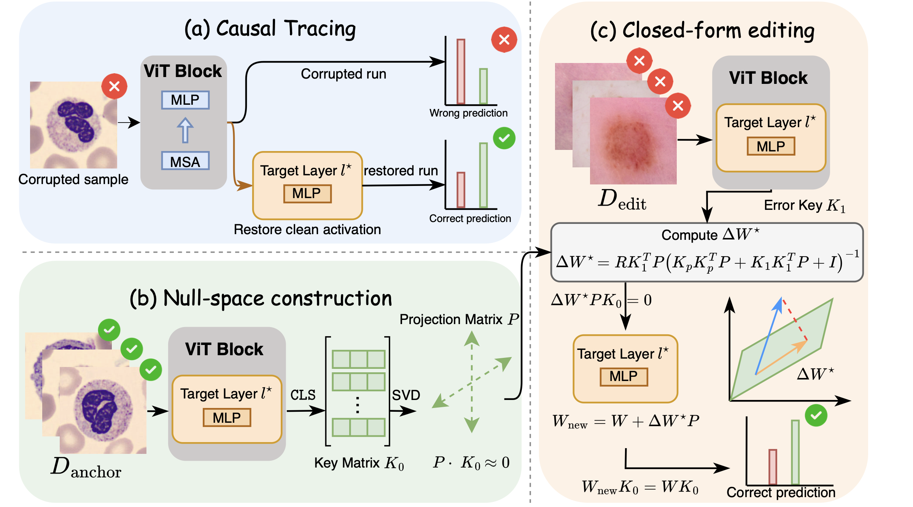

<div align="center">

# X-Edit

### Exact, Explicit, and Explainable Null-Space Editing<br/>for Medical Vision Transformers

<p>
  <a href="#"></a>
  <a href="#"></a>
  <a href="#"></a>
  <a href="#"></a>
  <a href="LICENSE"></a>
</p>

**Yuanye Liu, Siyuan Zhou, Ke Zhang, Lei Li, Wei Chen, Xiahai Zhuang**

<p>
  <a href="#"><b>📄 Paper</b></a> &nbsp;·&nbsp;
  <a href="#"><b>📚 arXiv</b></a> &nbsp;·&nbsp;
  <a href="#"><b>🌐 Project Page</b></a> &nbsp;·&nbsp;
  <a href="#citation"><b>📑 BibTeX</b></a>
</p>

<!-- TODO: replace links above once paper / arXiv / project page are live. -->

<a href="assets/Framework.pdf"></a>

<sub><i>X-Edit framework overview — click for high-resolution PDF.</i></sub>

</div>

---

## 🔥 News

- **2026-05** — Code released.
- **2026-05** — X-Edit is **early accepted** at **MICCAI 2026**.

## ✨ TL;DR

X-Edit is a post-hoc, training-free framework for **editing pretrained medical Vision Transformers**. It locates the layers responsible for a given mistake and applies a closed-form, null-space-constrained update that is:

- **Exact** — closed-form solution, no SGD on the edit.
- **Explicit** — edits only the targeted samples while provably preserving behavior on the rest.
- **Explainable** — the locator surfaces *which* layers carry the error.

The result: clinical-style knowledge corrections on ViTs without retraining or catastrophic forgetting.

## 🧭 Repository Structure

```
X-Edit/
├── src/
│   ├── main.py            # Entry point — orchestrates the full pipeline
│   ├── data_handler.py    # MedMNIST + Liver data loading
│   ├── trainer.py         # ViT fine-tuning
│   ├── locator.py         # Locate edit-responsible layers
│   ├── editor.py          # X-Edit null-space editor (+ head editor)
│   └── evaluator.py       # Before/after evaluation
├── scripts/               # Param search, baselines, result aggregation
├── pyproject.toml
└── README.md
```

## ⚙️ 1. Environment Setup

We use [`uv`](https://github.com/astral-sh/uv) for fast, reproducible environments.

```bash
cd X-Edit
uv venv
uv sync
```

> Use `uv run <cmd>` for everything below; manual `source .venv/bin/activate` is optional.

## 📦 2. Data Preparation

| Dataset family | Expected location |
|---|---|
| MedMNIST (`pathmnist`, `dermamnist`, `retinamnist`, `organamnist`, `bloodmnist`, `tissuemnist`) | `~/.medmnist/{dataset}_224.npz` |
| Liver (`liver4`, `liver2s`, `liver2a`) | `dataset/imgs.npy` and `dataset/labs.npy` |

MedMNIST `.npz` files are auto-downloaded on first use. For Liver, pass `--data-path dataset/` explicitly.

## 🚀 3. Quick Start

### Full pipeline (recommended)

```bash
# Default: pathmnist + vit-base
uv run python src/main.py --stage full --timestamp

# Custom dataset / model
uv run python src/main.py --stage full --dataset dermamnist --model vit-tiny --timestamp

# Liver datasets require --data-path
uv run python src/main.py --stage full --dataset liver2s --data-path dataset/ --timestamp
```

### Run a single stage

```bash
uv run python src/main.py --stage data   --dataset pathmnist
uv run python src/main.py --stage train  --dataset pathmnist --epochs 10
uv run python src/main.py --stage locate --dataset pathmnist
uv run python src/main.py --stage edit   --dataset pathmnist
uv run python src/main.py --stage eval   --dataset pathmnist
```

## 🎛️ 4. Common Arguments

| Flag | Values | Description |
|---|---|---|
| `--dataset` | `pathmnist`, `dermamnist`, `retinamnist`, `organamnist`, `bloodmnist`, `tissuemnist`, `liver4`, `liver2s`, `liver2a` | Target dataset |
| `--model` | `vit-base`, `vit-tiny` | Backbone |
| `--run-name` | string | Custom run name (recommended unless using `--timestamp`) |
| `--max-edits` | int \| `all` | Number of edit samples |
| `--data-path` | path | Liver data directory (e.g. `dataset/`) |
| `--timestamp` | flag | Auto-append timestamp to the run name |

## 📁 5. Outputs

```
checkpoints/   # Model checkpoints
logs/          # Training and editing logs
results/       # Evaluation outputs (CSV / JSON)
```

## 🧰 6. Optional Scripts

```bash
# Hyperparameter sweep
uv run python scripts/param_search.py --datasets pathmnist

# Aggregate results across runs
uv run python scripts/collect_results.py --results-dir results

# Batch baseline runs across GPUs
uv run python scripts/run_all_baselines.py --datasets pathmnist --num-gpus 1
```

## 📑 7. Citation

If you find this work useful, please cite:

```bibtex
@inproceedings{liu2026xedit,
  title     = {X-Edit: Exact, Explicit, and Explainable Null-Space Editing for Medical Vision Transformers},
  author    = {Liu, Yuanye and Zhou, Siyuan and Zhang, Ke and Li, Lei and Chen, Wei and Zhuang, Xiahai},
  booktitle = {Proceedings of the International Conference on Medical Image Computing and Computer-Assisted Intervention (MICCAI)},
  year      = {2026}
}
```

## 🙏 Acknowledgements

X-Edit builds on the null-space editing perspective introduced by [**AlphaEdit**](https://github.com/jianghoucheng/AlphaEdit), which we adapt and extend from large language models to medical Vision Transformers. We thank the authors for releasing their code.

<!-- TODO: add funding sources and compute providers as appropriate. -->

## 📄 License

This project is released under the [MIT License](LICENSE).
